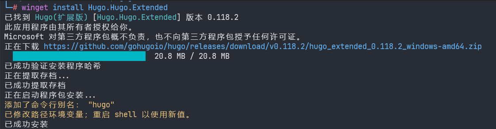
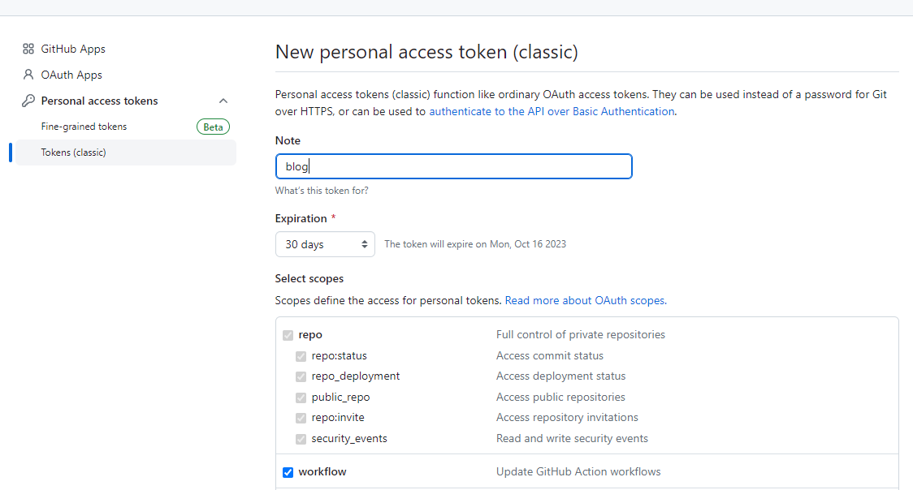
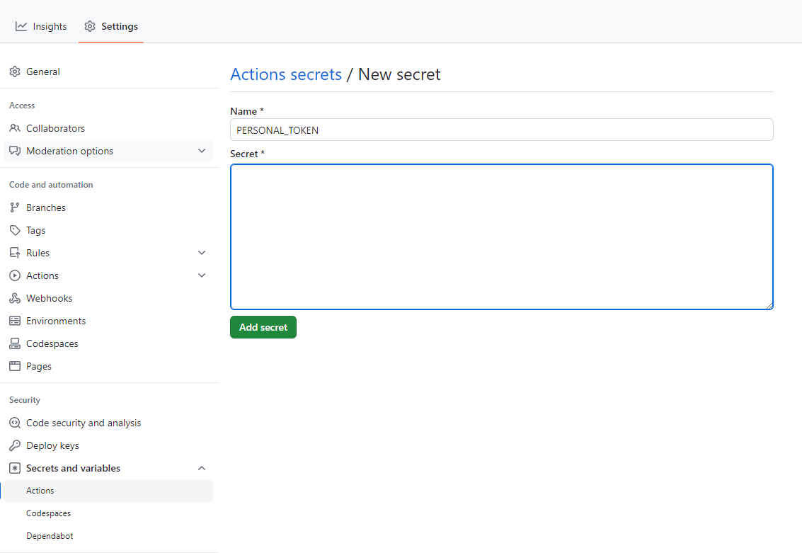

+++
archetype="home"
title = 'Home'
date = 2023-09-16T22:21:17+08:00
+++

# 博客是怎么建成的

hugo+github pages+github actions 自动发布

# Step 1 所需工具

安装golang

安装git

注册github账号

# Step 2 安装hugo

方法1：使用winget



方法2：使用 scoop

```bash
scoop install hugo-extended
```

验证：hugo version

# Step 3 Github配置

1.创建两个仓库，第一个为博客源码，如blog,第二个为用户名+github.io(必须为这样)

2.创建私人token,权限为repo所有，workflow,为了自动发布使用

settings/Developer Settings/Personal access tokens/Tokens(classic)



3. blog仓库设置token,secret填入全局设置好的token

   

# Step 4 使用hugo创建项目

hugo new site blog


# Step 5 拉取主题

cd blog

git init

git submodule add https://github.com/McShelby/hugo-theme-relearn.git themes/relearn

编辑配置文件hugo.toml

```plaintext
baseURL = 'https://liangweidonggood.github.io/'
languageCode = 'en-us'
title = 'liangweidong blog'
theme = 'relearn'
```

# Step 6 编辑主页

编辑archetypes中default.md,去除draft: true

```markdown
+++
title = '{{ replace .File.ContentBaseName "-" " " | title }}'
date = {{ .Date }}
+++
```

content目录下生成主页面

hugo new --kind home _index.md

头部添加archetype="home"

```plaintext
+++
archetype="home"
title = 'Home'
date = 2023-09-16T22:21:17+08:00
+++
```

编写正文。。。

注意事项：引入的图片资源，要在同目录下建立文件夹images

# Step 7 自动发布

项目根目录下建立配置文件：.github/workflows/deply.yml

```yaml
name: hugo-deploy-CI
on:
  push:
jobs:
  deploy:
    runs-on: ubuntu-latest
    steps:
      # step1 拉代码
      - name: Git checkout
        uses: actions/checkout@v4
        with:
          submodules: true
          fetch-depth: 0
      # step2 构建环境
      - name: Setup Hugo
        uses: peaceiris/actions-hugo@v2
        with:
          hugo-version: 'latest'
          extended: true
      # step3 构建
      - name: Build
        run: hugo
      # step4 发布
      - name: Deploy
        uses: peaceiris/actions-gh-pages@v3
        with:
          personal_token: ${{ secrets.PERSONAL_TOKEN }}
          external_repository: liangweidonggood/liangweidonggood.github.io
          publish_dir: ./public
          publish_branch: master
          commit_message: ${{ github.event.head_commit.message }}

```

# Step 8 提交代码

完整命令

```powershell
# 安装
scoop install hugo-extended
hugo version
hugo new site blog
cd blog
git init
# 拉取主题
git submodule add https://github.com/McShelby/hugo-theme-relearn.git themes/relearn
# 编辑hugo.toml和archetypes/default.md
hugo new --kind home _index.md
# 编辑_index.md
git pull --rebase origin master
git add .
git commit -m "init"
# 添加远程仓库
git remote add origin https://github.com/liangweidonggood/blog.git
git push origin master
```
