+++
title = 'Git'
date = 2023-09-18T08:55:43+08:00
weight = 1
+++

# git安装
官网：https://git-scm.com/

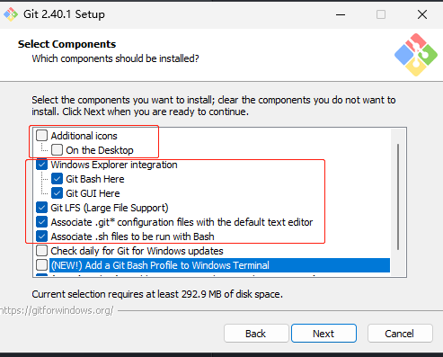

1.第一个框，是否在桌面创建图标

2.第二个框，系统默认

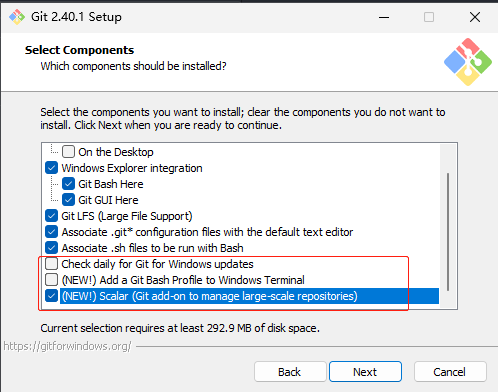

3.第三个框，每天检查更新

是否集成到windowsTerminal

Windows新开发的一种大规模仓库管理

使用vim内置编辑器

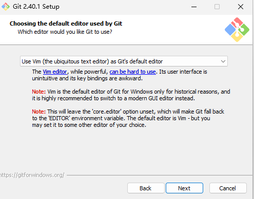

初始化主干名字

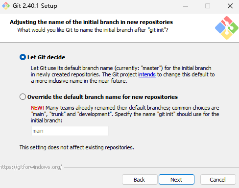

path环境变量

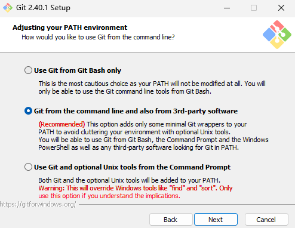

ssh执行文件

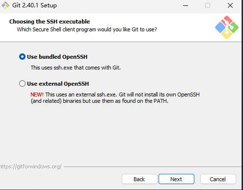

后端传输

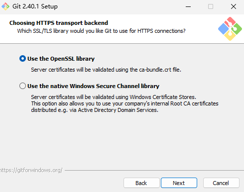

行尾符号转换

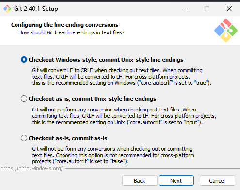

终端模拟器

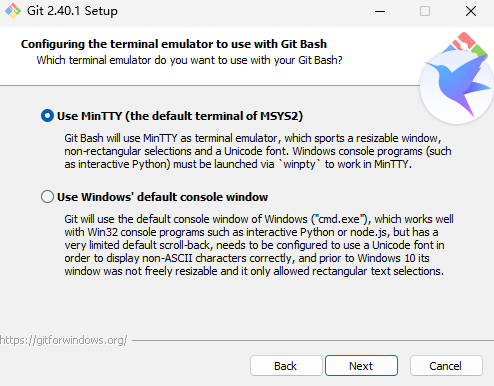

git pull

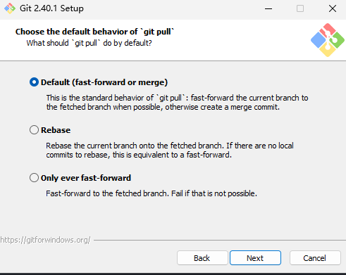

凭证

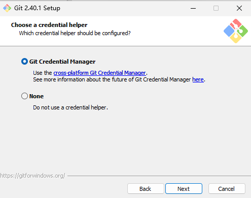

额外选项

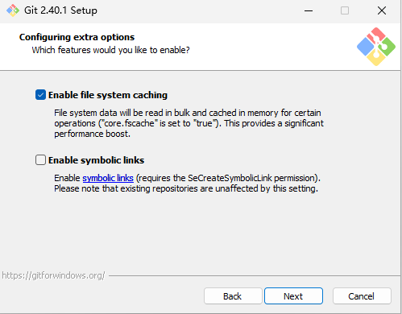

实验性功能

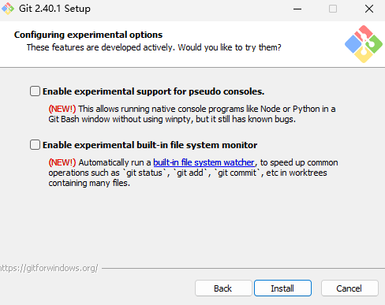

完成

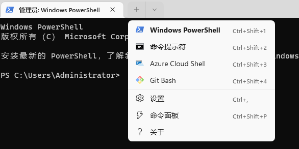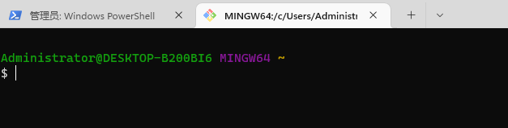

