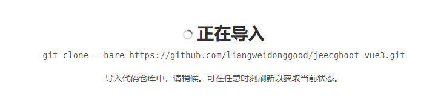
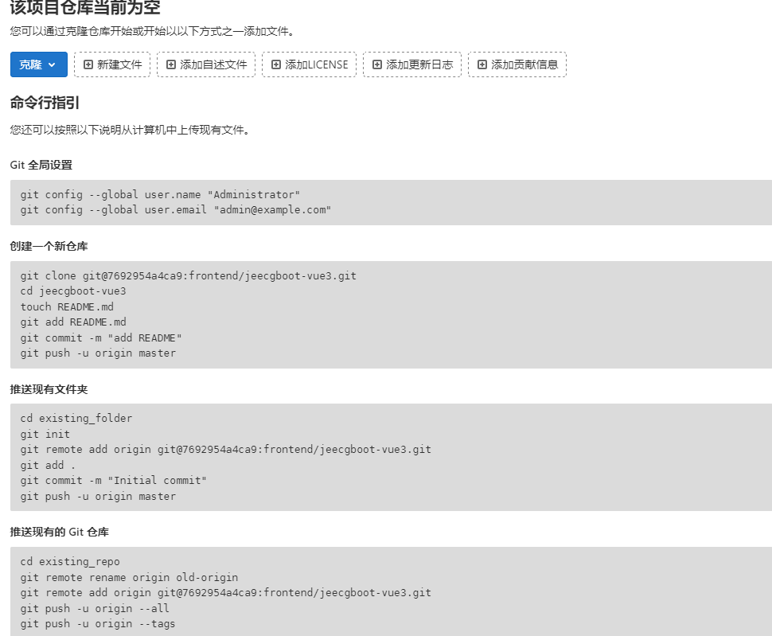
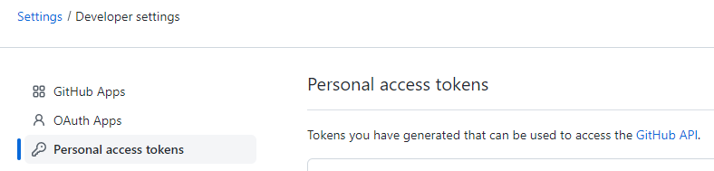
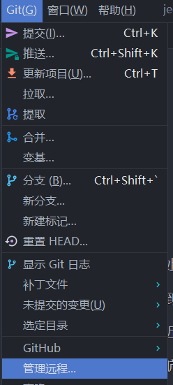
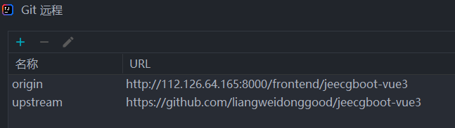

+++
title = '二次开发'
date = 2023-09-18T09:13:11+08:00
weight = 4
+++
# 需求

```
想在一个开源的项目上做一些二次开发，同时该开源项目也一直在迭代，那么如何保持跟它同步同时又保留自己的改动呢。
```

# 方案

```
安装 git ，分别新建 master 、 develop 分支。

当开发商发来新的版本后，基于 master 创建一个新的 sp-001 分支，将更新包直接在 sp-001 分支上面覆盖。

然后切换到 develop 分支，将 sp-001 合并到 develop ，解决冲突，冲突解决完成后，确认测试没问题，再 merge 到 master ，打上 tag 后 release 新版本，部署服务器去。


```

# 方案二

```
1.fork开源项目到自己的仓库,比如从
github.com/abc/cherry => github.com/dhl/cherry
然后clone 
git clone https://github.com/dhl/cherry


2.接下来cd到自己的仓库，开始如下操作
cd cherry
git checkout -b dev    #默认是master，master里永远跟开源的保持一致
git pull
git checkout master   #切回master，做更新
git remote add upstream https://github.com/abc/cherry.git  #设置upstream开源仓库.
git fetch upstream master #拉取开源的仓库upstream的master到本地
git merge upstream/master  #合并到本地master
git checkout dev  #切换到dev
git rebase master  #把刚刚拉取的更新merge到dev分支
```

# 实操

```
github上创建一个项目focktest
https://github.com/liangweidonggood/focktest
gitlib导入github项目
git clone --bare https://github.com/liangweidonggood/jeecgboot-vue3.git

拉取gitlib上的代码
git clone http://112.126.64.165:8000/gutai/focktest

cd focktest

默认是main,让他跟github里保持一致
git checkout -b dev

切回main
git checkout main

设置上流
git remote add upstream https://github.com/liangweidonggood/focktest

github上新增一个文件

本地main拉取github上面的更新
git fetch upstream main

合并到本地main
git merge upstream/main

提交到gitlib main (取消受保护的分支)
git push --set-upstream origin main


git checkout dev  #切换到dev
git rebase main  #把刚刚拉取的更新merge到dev分支

提交dev
git push --set-upstream origin dev

 


```

# 实操2

```
最终效果：总共有三个分支，master是最终的，受保护，fork分支保持与远程同步，dev分支是开发用的
fork + dev = master

gitlab设置两个保护分支，master和fork


开源项目jeecgboot
https://github.com/jeecgboot/jeecg-boot

fork到我的项目中
https://github.com/liangweidonggood/jeecg-boot

从我的项目中通过url导入到gitlib中
git clone --bare https://github.com/liangweidonggood/jeecg-boot.git
如果导不进去则用个人token

从gitlib克隆到本地
git clone http://112.126.64.165:8000/gutai/jeecg-boot

cd jeecg-boot
设置上流
git remote add upstream https://github.com/liangweidonggood/jeecg-boot

如果远程有更新就拉到fork分支下，然后合并到dev,最终合并到master


```





如果url导不进去则用下面的方法






