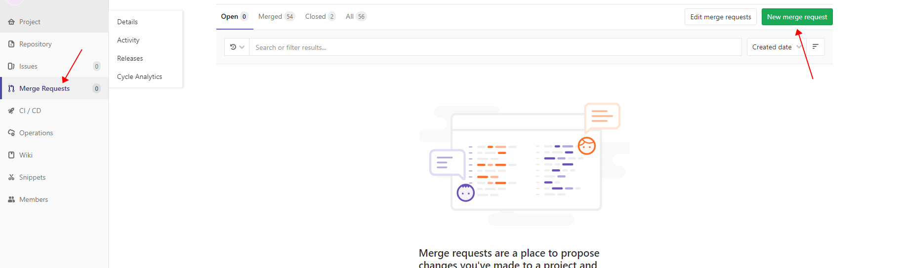
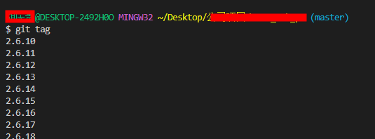
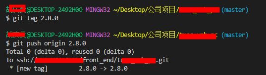

+++
title = '开发流程'
date = 2023-09-18T09:55:10+08:00
weight = 3
+++
# 流程


* `develop` 开发分支：开发人员每天都需要拉取/提交最新代码的分支
* `test` 测试分支：开发人员开发完并自测通过后，发布到测试环境的分支
* `release` 预发布分支：测试环境测试通过后，将测试分支的代码发布到预发环境的分支（这个得看公司支不支持预发环境，没有的话就可以不采用这条分支）
* `master` 线上分支：预发环境测试通过后，运营/测试会将此分支代码发布到线上环境
* `hotfix` 分支：在 `master` 发现新的 `bug` 时，需要创建一个 `hotfix`，完成后，合并到 `master` 和 `develop` 分支


**大致流程**

* 开发人员每天都需要拉取、提交最新的代码到 `develop` 分支
* 开发完毕后，开始  **集成测试** ，测试无误后提交到 `test` 分支，并发布到测试环境，交由测试人员测试
* 测试环境通过后，发布到 `release` 分支上，进行预发布环境测试
* 预发环境通过后，发布到 `master` 分支上并打上标签 `tag`
* 如果线上分支出现 `bug`，这时开发者应该基于预发布（没有预发布环境就用 `master` 分支），新建一个 `bug` 分支用来临时解决 `bug`，处理完成后申请合并到预发布分支（好处是不会影响正在开发中的功能）


## 分支模型和权限

我们用的是master（生产），release（预生产），integration（测试），develop（开发） 分支模型

git平台：[gitlab](https://so.csdn.net/so/search?q=gitlab&spm=1001.2101.3001.7020)

### 分支权限

**前端后端** ：拥有的的权限只有***开发***分支的合并

**开发组长** ：拥有的的权限有 ***开发*** 、 ***测试*** 、 ***预生产*** 、***生产***分支的合并

### 发布权限

**前端后端** **：拥有的的权限只有*****开发环境***的发布

**开发组长** **：拥有的的权限只有** ***开发环境*** **、*****测试环境***的发布

**测试** **：拥有的的权限只有** ***测试环境*** **、*****预生产***的发布

**运维** **：拥有的的权限只有*****生产***的发布


## 开发上线流程

1.需求评审

2.开发排期

3.开始开发

4.测试冒烟

5.冒烟通过提测，合代码到测试分支

6.测试测试，开发修bug

7.测试完成，发布预生产，合代码到预生产

8.预生产测试，修bug，修完的bug要走测试再走预生产

9.预生产产品验收，提交生产，合代码到生产，生产运营（客户）验收

10.结项


### 重点第三步开始（新需求开发）：

**1.开始开发要切换分支到release或者master**

```
## 注意：如果release上有别人没发到生产的代码，就切换到master分支
git checkout release
## or
git checkout master
```

**2.开发新需求先把 预发布/生产上最新代码拉下来**

```
git pull
```

**3.创建自己的独立分支并在这个分支上开发**

> git checkout -b 分支名
>
> 分支名要有命令规范，不要随便取，不然鬼才知道你这个分支是干嘛的
>
> 例如：业务或项目名缩写-版本-开发人姓名

```
## 例子
git checkout -b tfsc-2.7-hqg
```

**4.开发完成提交代码**

```
git add .
git commit -m'提交描述'
git push
```

**提交描述怎么写？**

**新需求提交：feat:需求8296-新增购物车需求**

**bug修复：fix:bug12890-购物车按钮点不动**

```
## 提交描述例子
git commit -m'fix:bug12890-购物车按钮点不动'
```

**5.开发前后端开发环境联调**

线上合并代码到develop分支，开发人员有权限，自己线上合并即可，然后jekins构建项目，结合你本地运行代码，你和后端就可以联调了（你本地调，后端看你发布到开发环境的代码构建后的地址）

就算你有权限自己合并开发分支，也禁止本地merge，所有的merge走线上（下面有指引）！

**6.线上申请自己分支合并代码到integration（测试）分支**



前面合到develop也是在这里合并！

**7.冒烟测试（冒烟在开发环境冒烟）**

**叫测试在开发环境进行冒烟测试，根据测试的测试用例来测试，有问题及时修改，然后提交代码到自己分支，再线上合并到开发分支。**

**直到冒烟测试通过，就申请提测，将自己分支最新代码合并到测试分支，联系对应的测试人员构建测试。**

**8.测试环境测试**

**边测边修复bug，直到测试完成，测试说可以，再将代码发到预生产，这个作为前端一般是没有权限合并的，只能提交合并申请后由开发组长来完成，然后交测试发布预生产**

**9.预生产环境测试**

**也是边测试边修复bug，注意：这里修复的bug要重走测试，测试环境测过了，再发预生产，预生产环境测完了，产品测试，产品觉得ok了，就验收，开始合并到生产环境**

**9.产环境测试发布验收**

**生产环境发布需要提上线申请，打tag，然后交给运维发布上线，最后客户验收！**

**关于tag怎么打看下面：**

**1.打tag切换到master分支**

**2.`git tag` 查看所有tag**



**3.`git tag tag名`**

**4.`git push origin tag名`**



**5.打线上申请**

Jenkins项目名称: tuns_web_pc

GIT仓库地址: [http://192.168.2.20/front_end/tuns_web_pc.git](http://192.168.2.20/front_end/tuns_web_pc.git)

当前发布分支TAG/分支: 2.8.0

异常处理: 回滚至 2.7.8
